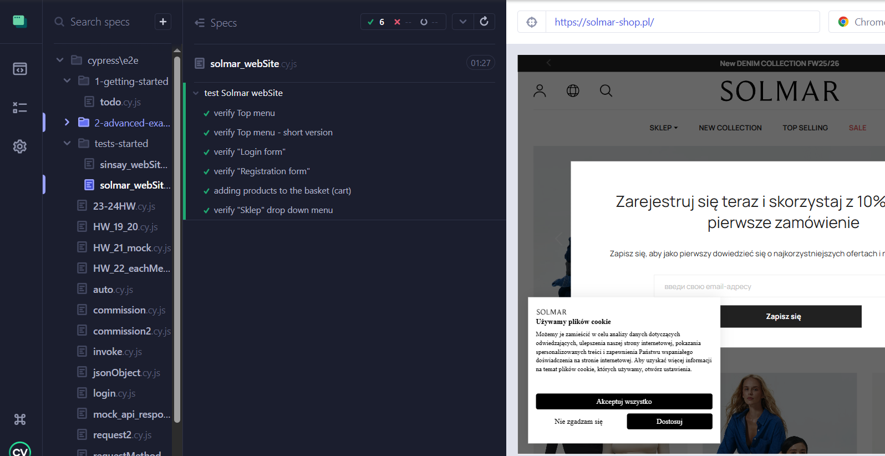

# Cypress Tests Example 🚀

This repository contains example **Cypress end-to-end tests** created as part of my QA portfolio.  
The tests are written to demonstrate my skills in manual and automation testing, test organization, and working with modern QA tools.

---
## 📌 Project Overview
- **Framework:** [Cypress](https://www.cypress.io/)  
- **Language:** JavaScript  
- **Purpose:** Practice project to show automation testing skills  
- **Focus areas:**  
  - UI testing  
  - Functional flows  
  - Negative scenarios  
---
## 🗂️ Project Structure
This repo contains a single Cypress test file created for demo purposes.

---
## 🚀 How to Run These Tests

This repo contains only one Cypress test file as an example.

To run it locally:
1. Clone the repository
	git clone https://github.com/Viktoriia09/qa-portfolio.git
	cd qa-portfolio
2. Create a new Cypress project:
   npm init -y
   npm install cypress --save-dev
3.Create the Cypress folder structure
	mkdir -p cypress/e2e
4.Copy the test file into Cypress folder
cypress/
  └── e2e/
      └── qa-portfolio.cy.js
5.Run Cypress
To open the Cypress Test Runner UI:
	npx cypress open
To run headless in the terminal:
	npx cypress run
---

### 🧪 Test Scenarios
- ✅ UI testing: dropdown menu, top navigation menu
- ✅ Login & registration form validation (empty fields → error message)
- ✅ Functional flow: adding items to favorites and shopping cart
- ✅ Negative scenarios: testing error messages on invalid input
---

## 📸 Example Screenshot

---
## Why this project?

To demonstrate my skills in Cypress automation testing
To show examples of test structure, organization, and documentation
To share part of my QA journey with potential employers

---
## About Me

I am a QA Engineer with experience in manual and automation testing.
Tools I’ve worked with: Cypress, Selenium, Postman, Fiddler, Cucumber, JIRA, TestRail.
I’m passionate about improving product quality, learning new tools, and growing as a professional.

📩 Feel free to connect with me on LinkedIn.

## 👤 Author
Created by **Viktoriia Pechenkina**
- 🌐 [LinkedIn](http://linkedin.com/in/viktoriia-pechenkina-2b3145362/?locale=en_US)
- 💻 [GitHub](https://github.com/Viktoriia09)

---
